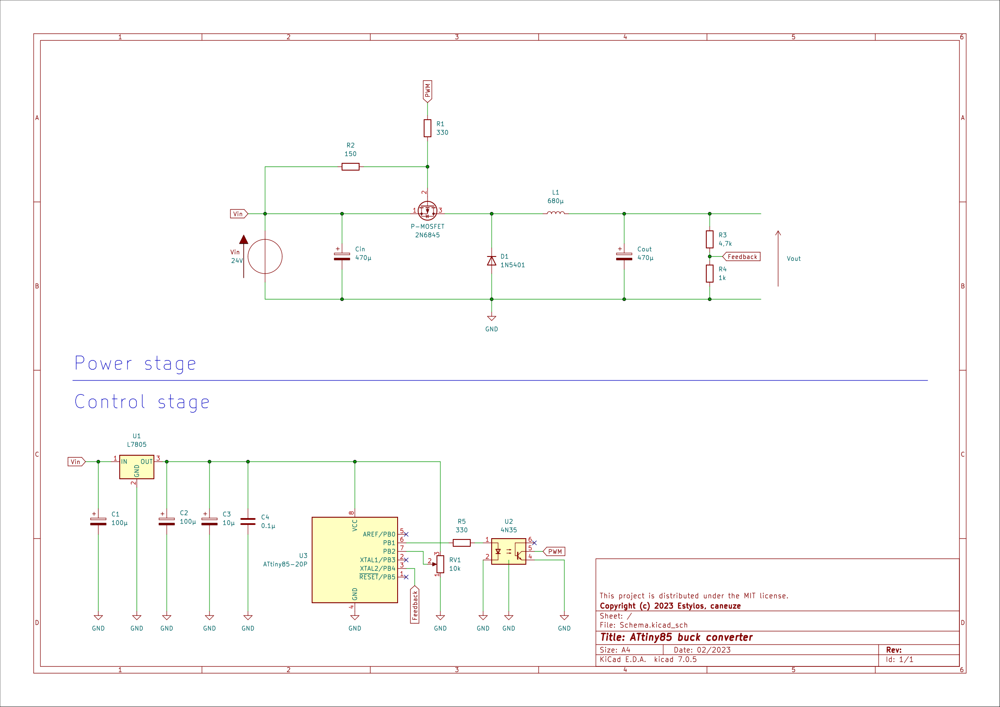

# ATtiny85 buck converter

As part of my 3rd year at Grenoble INP - Esisar engineering school, I had to build a buck converter. The specifications were as follows:
- Input: 24V DC voltage
- Output: DC voltage adjustable between 0 and 12V
- Max output current: 2A
- Controlled so that the output voltage is always as close as possible to the selected voltage, whatever the load applied to the output.
- Constraint: 1 week and use the components available in the school warehouse.

## Choice of components

We used [an application note from Texas Instrument](https://www.ti.com/lit/an/slva477b/slva477b.pdf) to select the components for our buck converter. Taking the calculated minimum values and the components available in the warehouse, we have selected the following components:
- 680µH inductance. **However, we had no information on its saturation current.**
- 470µF electrochemical input and output capacitor to limit ESR (ceramic capacitors of a few µF would have been sufficient according to calculations, but we didn't have any).
- 1N5401 diode with a max average forward rectified current of 3A and a blocking voltage of 100V.
- 2N6845 P-channel MOSFET with a max continuous drain current of -4A, a max Gate-to-Source voltage of +-20V and a Vgs between -2V and -4V.
- AVR ATtiny85 powered by a linear regulator and operated by an Arduino program generating a 50 kHz PWM signal for automation control.

## Efficiency

With this homemade converter made with local components, we succeeded in achieving a max efficiency of 55%. This efficiency may not be excellent compared with a commercial buck converter (an LM2596 has an efficiency of 90% for an input at 25V and an output at 12V 3A). But with the low choice of components, in particular the absence of power inductors, the circuit works, and it can output 12V at 1A ! (although with some overheating).

If you wanted to improve this circuit, you could choose better components for the power section: low ESR capacitors, a power inductor capable of passing the rated current of the specifications, a Schottky diode... You could also optimize the ATtiny program by implementing sleep functions when the potentiometer is not moved, and even implement a PI or PID controller to make the circuit even more stable.

For more information, the report produced as part of the academic project is available on the repo, in French only.

## The circuit

 

## References
- Cours de EE360 - Électronique de puissance, G. Dehay
- Switching regulator fundamentals, Texas Instruments
https://www.ti.com/lit/an/snva559c/snva559c.pdf 
- Basic Calculation of a Buck Converter, Texas Instruments
https://www.ti.com/lit/an/slva477b/slva477b.pdf
- Arduino Controlled Buck Converter, Game Instance
https://www.gameinstance.com/post/44/Arduino-controlled-buck-converter
- Generate 50kHz PWM with Arduino, Stack Exchange
https://arduino.stackexchange.com/questions/34633/how-can-i-generate-square-pulse-at-50khz-frequency-to-drive-two-mosfets-at-a-dut
- Correcteurs PID, Polytech Nice-Sophia
http://users.polytech.unice.fr/~pmasson/Enseignement/Elements%20de%20robotique%20avec%20arduino%20-%20PID%20-%20Projection%20-%20MASSON.pdf

